<a id="top"></a>
# 🗺️ 1. Web_project_around_express: EUA Afora

Meu primeiro projeto back-end. 🚀

Projeto do curso de Desenvolvimento Web Full-Stack da TripleTen. 

Focado na criação do meu próprio servidor para o projeto "EUA Afora", onde será possível verificar tokens, salvar e retornar cards e lembrar se um determinado usuário gostou ou não de um cartão. 

**Aprendizado:** trabalhar com bases de dados, configurar segurança, testes e implantar o back-end em uma máquina remota.

**Objetivo:** criar um servidor com uma API e autenticação de usuário. 🔐


# 📑 2. Índice:

- 🖥️ Instruções de Uso
  - 🔧 Pré-requisitos
  - 📦 Instalação
  - ▶️ Executando o servidor
  - 🌐 Testando as rotas da API
  - ⚠️ Tratamento de erros

- 🧰 Tecnologias e Técnicas Utilizadas
  - ⚙️ Ambiente e Servidor
  - 📦 Gerenciamento de pacotes
  - 🔍 Qualidade de código
  - 📂 Organização e Ferramentas
  - 📝 Versionamento

- ✅ Funcionalidades Implementadas
  - ⚙️ Configuração inicial do projeto
  - 🚀 Servidor Express
  - 🌐 Rotas da API
  - 🛡️ Tratamento de erros
  - 🗂️ Estrutura modular do projeto
  - 📄 Trabalho com arquivos

- 🎥 Demonstração

- 🚀 Próximos Passos

- 💡 Melhorias

[🔝 Voltar ao topo](#top)

# 🖥️ 3. Instruções de Uso:

## 🔧 Pré-requisitos

- **Node.js** instalado (versão LTS). 🟢

- **npm** configurado no ambiente: v10.9.2. 📦

- Um cliente de API (ex.: **Postman**, **Insomnia** ou navegador para rotas simples). 🌐

**Obs:** a versão do Node está definida no `package.json`, em `"engines"`:

```json
"engines": {
  "node": "^22.15.0"
}
```

## 📦 Instalação

Clone o repositório em sua máquina local e instale as dependências:

```bash
# Opção 1: HTTPS
git clone https://github.com/VanessaYuriAB/web_project_around_express.git

# Opção 2: SSH
git clone git@github.com:VanessaYuriAB/web_project_around_express.git 

cd web_project_around_express
npm install
```

📌 **Dicas:** 

- `.npmrc`

  Configuração `save-exact=true` para garantir que todas as dependências sejam instaladas com a **mesma versão** em qualquer ambiente.

- `.vscode/settings.json`
  ```json
  {
  "[javascript]": {
    "editor.defaultFormatter": "dbaeumer.vscode-eslint"
  },
  "[javascriptreact]": {
    "editor.defaultFormatter": "dbaeumer.vscode-eslint"
  },
  "editor.formatOnSave": true,
  "eslint.format.enable": true
  }
  ```
    - *Configura o VS Code para usar **ESLint** como formatador padrão para arquivos `.js` e `.jsx`.*  
    - *Habilita **format on save** para manter o código consistente.*  
    - *Não está versionado no projeto, pois a pasta `.vscode/` está no `.gitignore`.*

    ⚠️ ***OBS:** essa configuração formata automaticamente apenas o que o **ESLint** consegue aplicar. Alguns ajustes podem precisar ser feitos manualmente ou com o comando:*

    ```bash
    npm run lint:fix
    ```

## ▶️ Executando o servidor

Inicie o servidor na porta 3000:

```bash
npm run start
```

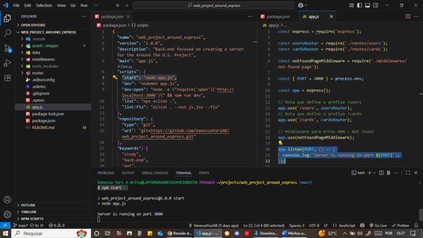

*▶️ `start`: servidor iniciado com `node app.js`.*

Ou, para rodar com **hot reload** durante o desenvolvimento:

```bash
npm run dev
```

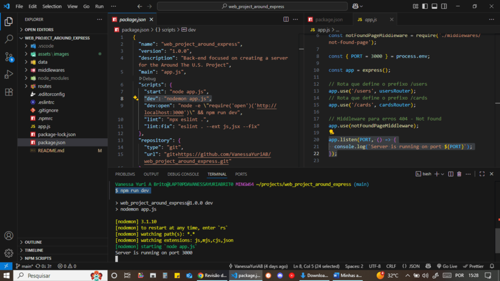

*♻️ `dev`: servidor com **hot reload** via `nodemon`.*

Para abrir automaticamente o navegador e iniciar o servidor com **hot reload**:

```bash
npm run dev:open
```


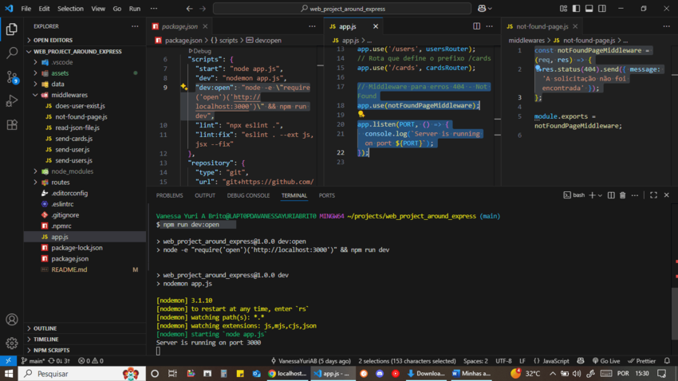

*🔗 `dev:open`: abre automaticamente o navegador em `http://localhost:3000` e ativa **hot reload**.*

## 🌐 Testando as rotas da API

🔹 **Listar todos os usuários:**

- Request:

```bash
GET http://localhost:3000/users
```

- Response (200 OK):

```json
[
  {
    "nome": "Ada Lovelace",
    "sobre": "Matemático, escritor",
    "avatar": "https://www.biography.com/.image/t_share/MTE4MDAzNDEwODQwOTQ2MTkw/ada-lovelace-20825279-1-402.jpg",
    "_id": "dbfe53c3c4d568240378b0c6"
  },
  {
    "nome": "Tim Berners-Lee",
    "sobre": "Inventor, cientista",
    "avatar": "https://media.wired.com/photos/5c86f3dd67bf5c2d3c382474/4:3/w_2400,h_1800,c_limit/TBL-RTX6HE9J-(1).jpg",
    "_id": "d285e3dceed844f902650f40"
  },
  {
    "nome": "Grace Hopper",
    "sobre": "Cientista da computação",
    "avatar": "https://upload.wikimedia.org/wikipedia/commons/thumb/a/ad/Commodore_Grace_M._Hopper%2C_USN_%28covered%29.jpg/800px-Commodore_Grace_M._Hopper%2C_USN_%28covered%29.jpg",
    "_id": "7d8c010a1c97ca2654997a95"
  },
  {
    "nome": "Alan Turing",
    "sobre": "Matemático, criptoanalista",
    "avatar": "https://cdn.britannica.com/81/191581-050-8C0A8CD3/Alan-Turing.jpg",
    "_id": "f20c9c560aa652a72cba323f"
  },
  {
    "nome": "Katherine Johnson",
    "sobre": "Matemático",
    "avatar": "https://upload.wikimedia.org/wikipedia/commons/thumb/6/6d/Katherine_Johnson_1983.jpg/800px-Katherine_Johnson_1983.jpg",
    "_id": "8340d0ec33270a25f2413b69"
  },
  {
    "nome": "Margaret Hamilton",
    "sobre": "Engenheiro de software",
    "avatar": "https://upload.wikimedia.org/wikipedia/commons/thumb/6/68/Margaret_Hamilton_1995.jpg/800px-Margaret_Hamilton_1995.jpg",
    "_id": "3c8c16ee9b1f89a2f8b5e4b2"
  }
]
```

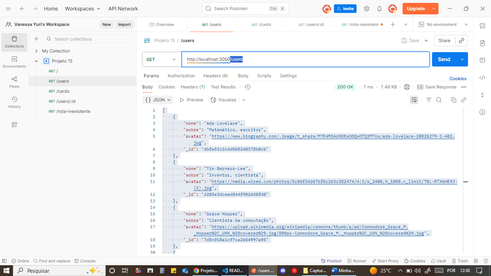

*`GET /users` → `200 OK` ✅.*

🔹 **Listar todos os cards:**

- Request:

```bash
GET http://localhost:3000/cards
```

- Response (200 OK):

```json
[
  {
    "likes": [
      {
        "name": "Tim Berners-Lee",
        "about": "Inventor, scientist",
        "avatar": "https://media.wired.com/photos/5c86f3dd67bf5c2d3c382474/4:3/w_2400,h_1800,c_limit/TBL-RTX6HE9J-(1).jpg",
        "_id": "d285e3dceed844f902650f40"
      }
    ],
    "_id": "5d208fb50fdbbf001ffdf72a",
    "name": "White Sulphur Springs, WV",
    "link": "https://upload.wikimedia.org/wikipedia/commons/thumb/5/58/2008-0831-TheGreenbrier-North.jpg/1024px-2008-0831-TheGreenbrier-North.jpg",
    "owner": {
      "name": "Katherine Johnson",
      "about": "Mathematician",
      "avatar": "https://upload.wikimedia.org/wikipedia/commons/thumb/6/6d/Katherine_Johnson_1983.jpg/800px-Katherine_Johnson_1983.jpg",
      "_id": "8340d0ec33270a25f2413b69"
    },
    "createdAt": "2019-07-06T12:10:29.149Z"
  }
]
```

📝 **Obs:** a rota retorna todos os cards, cada um com `owner` e `likes`. Para ver o JSON completo, confira o arquivo [`cards.json`](./data/cards.json).

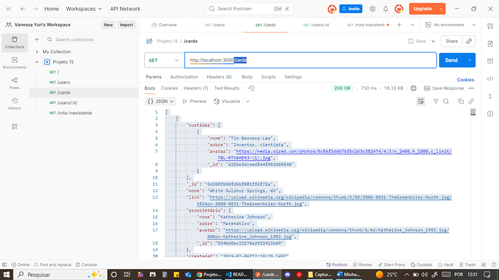

*`GET /cards` → `200 OK` ✅.*

🔹 **Buscar usuário por ID:**

- Request:

```bash
GET http://localhost:3000/users/:id
```

Exemplo:

```bash
GET http://localhost:3000/users/dbfe53c3c4d568240378b0c6
```

- Response (200 OK):

```json
{
  "nome": "Ada Lovelace",
  "sobre": "Matemático, escritor",
  "avatar": "https://www.biography.com/.image/t_share/MTE4MDAzNDEwODQwOTQ2MTkw/ada-lovelace-20825279-1-402.jpg",
  "_id": "dbfe53c3c4d568240378b0c6"
}
```

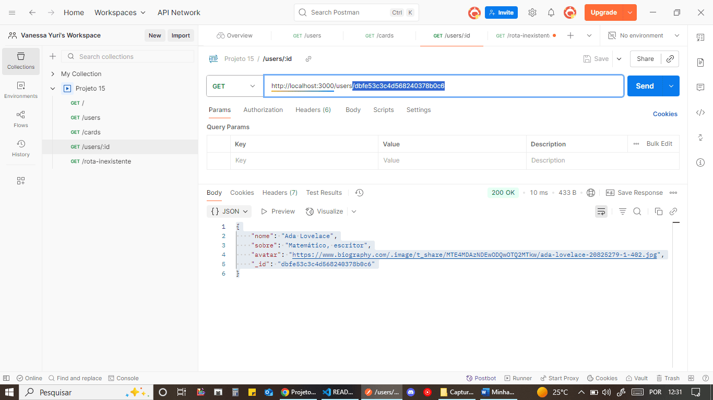

*`GET /users/:id` → `200 OK` ✅.*

- Response (404 Not Found):

```json
{"message":"ID do usuário não encontrado"}
```

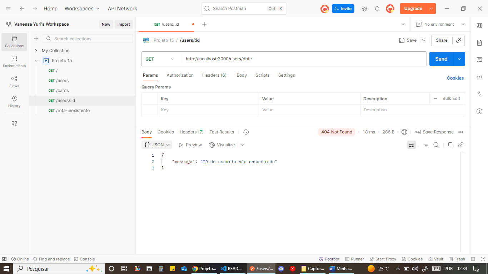

*`GET /users/:id` → `404 Not Found` ❌.*

🔹 **Rota inexistente:**

- Request (exemplo):

```bash
GET http://localhost:3000/alguma-coisa
```

- Response (404 Not Found):

```json
{ "message": "A solicitação não foi encontrada" }
```

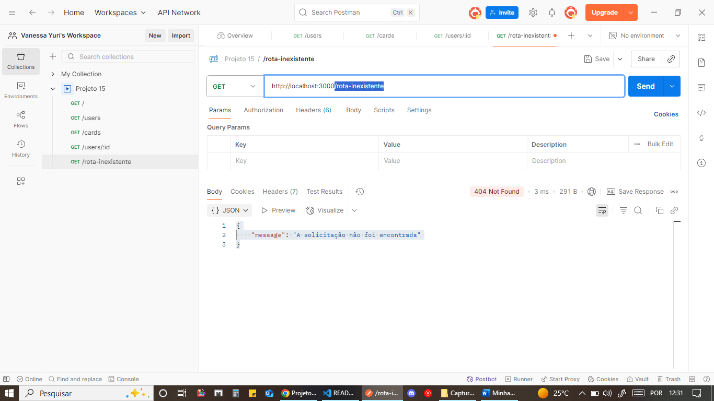

*`GET /alguma-coisa` → `404 Not Found` ❌.*


## ⚠️ Tratamento de erros

- ❌ **404 Not Found** → ID não encontrado ou rota inexistente. 

- 💥 **500 Internal Server Error** → erro interno do servidor.  

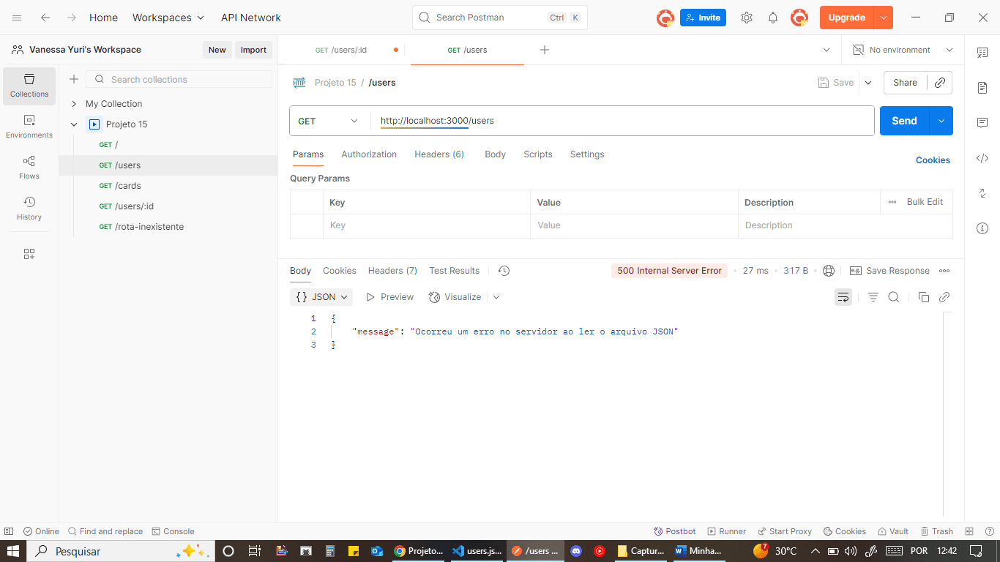

*Falha ao ler o arquivo JSON 💥.*

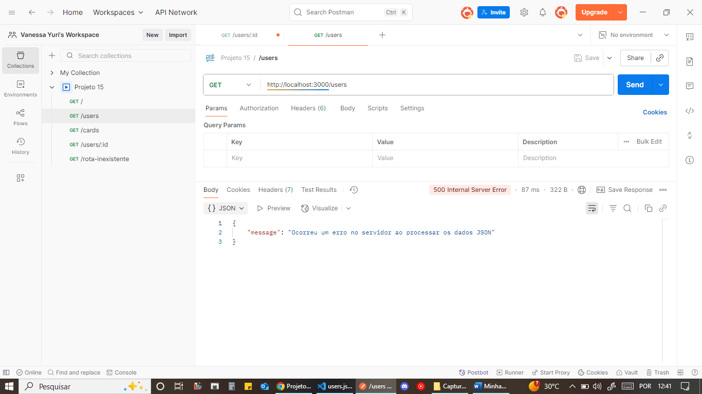

*Falha ao processar os dados JSON 💥.*

- Todas as mensagens de erro seguem o formato:

```json
{ "message": "Descrição do erro" }
```

[🔝 Voltar ao topo](#top)

# 🧰 4. Tecnologias e Técnicas Utilizadas:

## ⚙️ Ambiente e Servidor

- **Node.js** → ambiente de execução JavaScript no back-end: LTS recomendado, v22.15.0. 🟢

- **Express.js** → framework minimalista para criação do servidor e definição das rotas: v5.1.0. 📂

## 📦 Gerenciamento de pacotes

- **npm** → instalação e gerenciamento de dependências: v10.9.2. 🔧

## 🔍 Qualidade de código

- **EditorConfig** → consistência na formatação (indentação, encoding, quebras de linha). 📝

- **ESLint (Airbnb Base)** → padronização do estilo de código JavaScript: v8.56.0. 💻

## 📂 Organização e Ferramentas
 
- **fs** → leitura assíncrona de arquivos JSON (nativo do Node.js). 📄

- **path** → construção de caminhos de arquivos multiplataforma (nativo do Node.js). 🛤️

- **nodemon** → recarga automática do servidor durante o desenvolvimento: v3.1.10. 🔁

- **open** → abertura automática do navegador com o início do servidor com hot reload: v7.4.2. 🌐

## 📝 Versionamento

- **Git & GitHub** → versionamento e hospedagem do código-fonte. 🗃️

[🔝 Voltar ao topo](#top)

# ✅ 5. Funcionalidades Implementadas:

## ⚙️ Configuração inicial do projeto

- Criação do repositório `web_project_around_express` com `npm init`.

- Inclusão dos arquivos de configuração: `.gitignore`, `.editorconfig` e `.eslintrc`.

- O arquivo `.gitignore` contém pelo menos a pasta `node_modules`.

- Instalação e configuração do **ESLint** com o guia de estilo Airbnb (v8.56.0).

- Exceções personalizadas no ESLint para: `_id`, `console.log` e estilo de quebra de linha `LF`.

- Criação do `README.md` com informações do projeto. 📄

## 🚀 Servidor Express

- Arquivo principal `app.js` criado como ponto de entrada.

- Servidor configurado para rodar na porta **3000**.

- Scripts disponíveis: 

  | Script     | Descrição                                |
  | ---------- | ---------------------------------------- |
  | `start`    | Inicia o servidor com Node               |
  | `dev`      | Inicia com hot reload via nodemon        |
  | `dev:open` | Abre navegador + hot reload              |
  | `lint`     | Verifica conformidade ESLint             |
  | `lint:fix` | Corrige problemas ESLint automaticamente |


## 🌐 Rotas da API

- **`GET`** `/users` - `200 OK` → retorna a lista completa de usuários a partir de `users.json`.

- **`GET`** `/cards` - `200 OK` → retorna a lista completa de cards a partir de `cards.json`.

- **`GET`** `/users/:id` - `200 OK` → retorna um usuário específico pelo `id`.

  - **`GET`** `/users/:id` - `404 Not Found` → se o ID não for encontrado, retorna mensagem de erro.

- **`GET`** `/alguma-coisa` - `404 Not Found` → se a rota for inexistente, retorna mensagem de erro.

## 🛡️ Tratamento de erros

- **`500 Internal Server Error`** → ocorre quando há um erro interno no servidor, por exemplo: falha ao ler ou processar o arquivo JSON → retorna mensagem de erro.

- **`404 Not Found`** → ocorre quando o recurso solicitado não existe (ex.: ID inválido ou rota inexistente, como mencionado na sub-seção acima).

- Todas as respostas de erro seguem o formato padronizado com apenas o campo `message`.

- O servidor não trava em solicitações inválidas e não gera erros não tratados no console.

## 🗂️ Estrutura modular do projeto

- 📂 `data/` → arquivos de dados JSON (`users.json` e `cards.json`).

- 📂 `routes/` → arquivos responsáveis pelo roteamento (`users.js` e `cards.js`).

- 📂 `middlewares/` → middlewares de suporte para leitura e resposta das rotas.

- Código organizado em módulos reutilizáveis, facilitando manutenção e expansão. 🔧

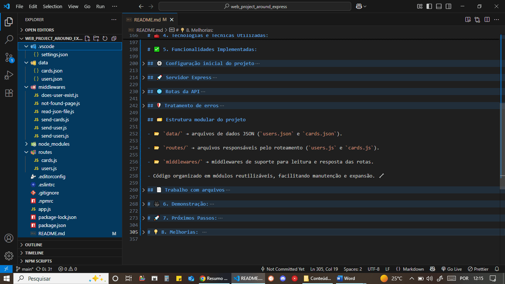

## 📄 Trabalho com arquivos

- Uso do módulo **fs** (`fs.readFile`) para leitura assíncrona dos arquivos JSON.

- Uso do módulo **path** (`path.join`) para construção segura e multiplataforma dos caminhos de arquivos.

- Tratamento de erros de leitura com `try/catch` e retorno padronizado de mensagens de erro.

[🔝 Voltar ao topo](#top)

# 🎥 6. Demonstração:

Vídeo do uso da aplicação mostrando suas funcionalidades. 🎞️

[▶️ Assista no Loom, clicando aqui.](https://www.loom.com/share/d7a2171497594e05a8fb09b45f2c8f48?sid=405b1afa-7fa8-40ac-80ae-1409b44d5d5b)

# 🚀 7. Próximos Passos:

O projeto está preparado para evoluir nos próximos sprints do curso, incluindo:

[] **Integração com banco de dados** 💾

  - Substituir os arquivos JSON por um banco de dados real (ex.: MongoDB).

[] **Autenticação de usuários** 🔑

  - Implementar login, tokens JWT e validação de sessões.

  - Criar middlewares de autenticação e autorização para proteger rotas específicas.

[] **Tratamento avançado de erros e logs** 📝

  - Middleware centralizado para erros, com logging detalhado para debug.

  - Respostas padronizadas e rastreamento de exceções no servidor.

[] **Deploy do servidor** 🌐

  - Hospedar a API em um serviço remoto para integração com o front-end.

[] **Validação e segurança de dados** 🛡️

  - Validação de entradas do usuário, proteção contra injeção e ataques comuns.

[] **Testes automatizados** ✅

  - Criação de testes unitários e de integração para garantir a confiabilidade da API.

[🔝 Voltar ao topo](#top)

# 💡 8. Melhorias: 

> - 📡 Especificar códigos de status de resposta HTTP nas respostas da API. Atualmente utilizados: 404 e 500. Futuramente, incluir, por exemplo: 422 e 503.

> - 📊 Implementar monitoramento e logging detalhado de requisições.

> - 📑 Adicionar índice clicável, com links internos para cada seção.

[🔝 Voltar ao topo](#top)
