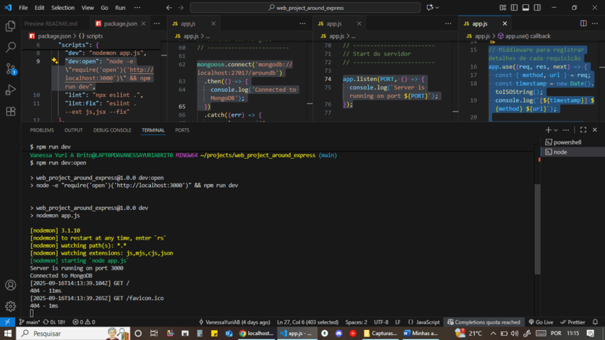
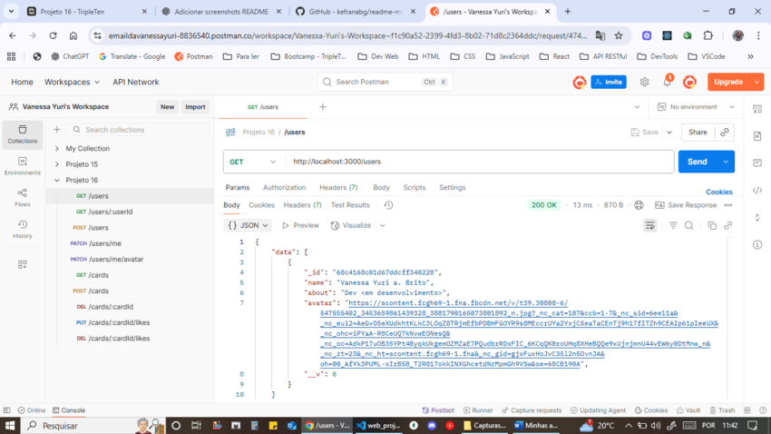
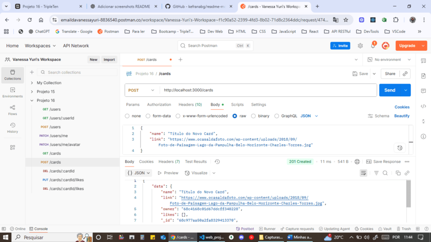
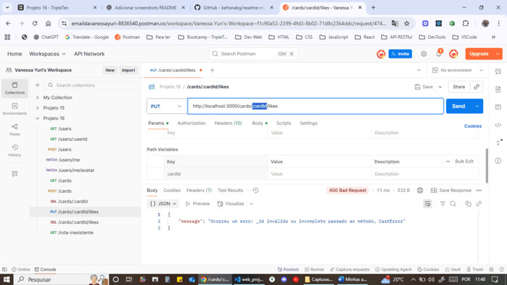
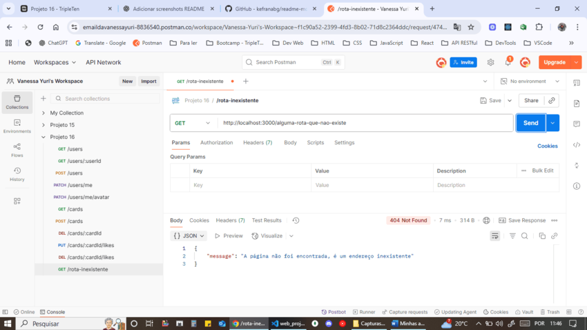
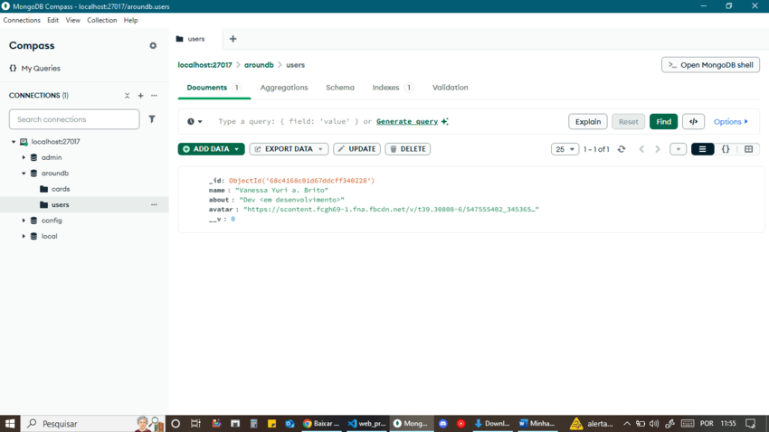
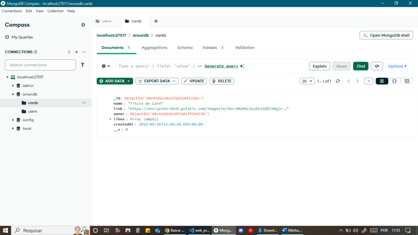
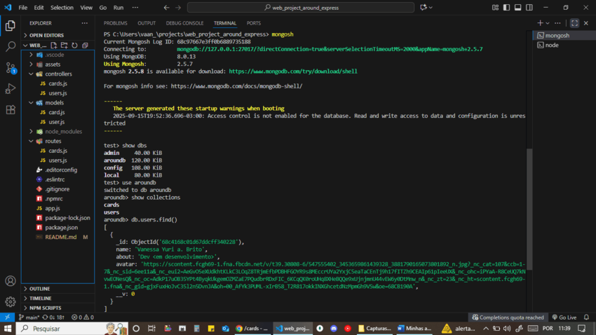
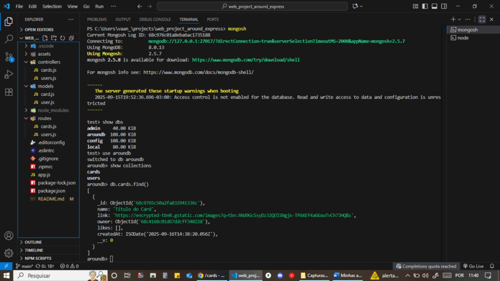
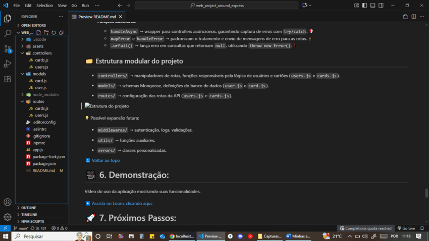

<a id="top"></a>
# 🗺️ 1. Web_project_around_express: EUA Afora

Este é o meu **primeiro e segundo projeto back-end** do curso de **Desenvolvimento Web Full-Stack da TripleTen**. 🚀

Foram **duas sprints de dedicação** até aqui:

- **Sprint 15** → Introdução ao Back-End com **Node.js** e **Express.js**

- **Sprint 16** → Conexão com bancos de dados e criação de uma **API REST**

O projeto consiste em uma **API RESTful** para o *EUA Afora*, com as seguintes funcionalidades:

- 👤 Gerenciamento de **usuários** e **cards**

- 💾 **Persistência de dados** no MongoDB

- ❤️ Registro de curtidas e remoção de curtidas em cards

- 📤 Retorno de dados em formato JSON de forma padronizada

**Aprendizado**:

- Trabalhar com bases de dados reais

- Configurar segurança e tratamento de erros

- Preparar o servidor para testes e futura implantação em ambiente remoto

**Objetivo**:

Criar um servidor robusto com **CRUD completo** e **autenticação de usuários**. 🔐


# 📑 2. Índice:

- 🖥️ Instruções de Uso
  - 🔧 Pré-requisitos
  - 📦 Instalação
  - ▶️ Executando o servidor
  - 🌐 Testando as rotas da API
  - ⚠️ Tratamento de erros

- 🧰 Tecnologias e Técnicas Utilizadas
  - ⚙️ Ambiente e Servidor
  - 📦 Gerenciamento de pacotes
  - 🔍 Qualidade de código
  - 📂 Organização e Ferramentas
  - 📝 Versionamento

- ✅ Funcionalidades Implementadas
  - ⚙️ Configuração inicial do projeto
  - 🚀 Servidor Express
  - 🌐 Rotas da API
  - 📝 Middlewares
  - 🛡️ Tratamento de erros
  - 💾 Banco de dados
  - 🗂️ Estrutura modular do projeto


- 🎥 Demonstração

- 🚀 Próximos Passos

- 💡 Melhorias

[🔝 Voltar ao topo](#top)

# 🖥️ 3. Instruções de Uso:

## 🔧 Pré-requisitos

- **Node.js** instalado (versão LTS). 

- **npm** configurado no ambiente: v10.9.2. 

- **MongoDB Server** instalado: v8.0.13. 

- **MongoDB Shell (Mongosh)**: opcional, v2.5.7. 

- Um cliente de API (ex.: **Postman**, **Insomnia** ou navegador para rotas simples). 

📌 A versão do Node está definida no `package.json`, em `"engines"`:

```json
"engines": {
  "node": "^22.15.0"
}
```

## 📦 Instalação

1. Clone o repositório em sua máquina local:

```bash
# Opção 1: HTTPS
git clone https://github.com/VanessaYuriAB/web_project_around_express.git

# Opção 2: SSH
git clone git@github.com:VanessaYuriAB/web_project_around_express.git 

cd web_project_around_express
```

2. Instale as dependências do projeto:

```bash
npm install # instala todas as dependências listadas no package.json
```

📌 **Dicas:** 

- `.npmrc`

  Configuração `save-exact=true` para manter **versões exatas** de dependências.

- `.vscode/settings.json`
  ```json
  {
  "[javascript]": {
    "editor.defaultFormatter": "dbaeumer.vscode-eslint"
  },
  "[javascriptreact]": {
    "editor.defaultFormatter": "dbaeumer.vscode-eslint"
  },
  "editor.formatOnSave": true,
  "eslint.format.enable": true
  }
  ```
    - *Configuração do VS Code para formatador padrão **ESLint** em arquivos `.js` e `.jsx`.*  
    - ***format on save** habilitado para manter o código consistente.*  
    - *Sem versionamento no projeto, pasta `.vscode/` inclusa no `.gitignore`.*

    ⚠️ Essa configuração formata automaticamente apenas o que o **ESLint** consegue aplicar. Alguns ajustes podem precisar ser feitos manualmente ou usando o comando:

    ```bash
    npm run lint:fix
    ```

## ▶️ Executando o servidor

Inicie o servidor na porta **3000**, no modo normal:

```bash
npm run start
```


*▶️ `start`: servidor iniciado com `node app.js`.*

Ou, para rodar com **hot reload** durante o desenvolvimento:

```bash
npm run dev
```


*♻️ `dev`: servidor com **hot reload** via `nodemon`.*

Ou, então, para **abrir automaticamente o navegador** e iniciar o servidor com **hot reload**:

```bash
npm run dev:open
```




*🔗 `dev:open`: abre automaticamente o navegador em `http://localhost:3000` e ativa **hot reload**.*

## 🌐 Testando as rotas da API

Conexão com o banco de dados MongoDB: 

``` javascript
// app.js
mongoose.connect('mongodb://localhost:27017/aroundb')
  .then(() => {
    console.log('Connected to MongoDB');
  })
  .catch((err) => {
    console.error('Error connecting to MongoDB:', err);
  });
```

🟢 _O banco `aroundb` será criado automaticamente._ 

___

👤 **Rotas de Usuários:**

| Método | Rota               | Descrição                  |
| ------ | ------------------ | -------------------------- |
| GET    | `/users`           | Lista todos os usuários    |
| GET    | `/users/:userId`   | Retorna um usuário por ID  |
| POST   | `/users`           | Cria um novo usuário       |
| PATCH  | `/users/me`        | Atualiza perfil do usuário |
| PATCH  | `/users/me/avatar` | Atualiza avatar            |

Exemplo POST:

```json
{
  "name": "Ada Lovelace",
  "about": "Matemática",
  "avatar": "https://www.example.com/avatar.jpg"
}
```

Exemplo GET no Postman:



_Teste da rota **GET /users** mostrando o retorno JSON com usuário cadastrado._

---

🃏 **Rotas de Cards:**

| Método | Rota                   | Descrição              |
| ------ | ---------------------- | ---------------------- |
| GET    | `/cards`               | Lista todos os cards   |
| POST   | `/cards`               | Cria um card           |
| DELETE | `/cards/:cardId`       | Remove um card         |
| PUT    | `/cards/:cardId/likes` | Curte um card          |
| DELETE | `/cards/:cardId/likes` | Descurte um card       |


Exemplo POST:

```json
{
  "name": "White Sulphur Springs, WV",
  "link": "https://upload.wikimedia.org/...jpg"
}
```

Exemplo POST no Postman:



_Teste da rota **POST /cards** mostrando o retorno JSON com o cartão cadastrado._

🛠️ O `owner` é definido temporariamente via middleware:

```json
app.use((req, res, next) => {
  req.user = {
    _id: '68c4168c01d67ddcff340228', // _id do usuário teste criado via Postman
  };

  next();
});
```

📝 Notas sobre **likes**/**dislikes**:

- **Curtir um card**: `PUT /cards/:cardId/likes`:

  ❤️ Adiciona o `_id` do usuário ao array `likes` apenas se ainda não estiver presente (`$addToSet`).

- **Descurtir um card**: `DELETE /cards/:cardId/likes`:

  💔 Remove o `_id` do usuário do array `likes` (`$pull`).

- Cada card só pode ser curtido **uma vez por usuário**.

- Todas as respostas de sucesso retornam o card atualizado em JSON.

## ⚠️ Tratamento de erros

- **400 Bad Request** ❌: dados inválidos enviados no corpo da requisição. Pode ser:

  - **ValidationError** → falha na validação dos campos (ex.: tamanho mínimo, obrigatório, formato da URL).

  

  _Teste da rota **PATCH /users/me** no Postman, mostrando o retorno de **ValidationError** quando os dados enviados não atendem aos critérios do schema._

  - **CastError** → formato de dado inválido (ex.: `_id` de usuário ou card não é um `ObjectId` válido).

  

  _Teste da rota **PUT /cards/:cardId/likes** no Postman, mostrando o retorno de `CastError` quando o `_id` do cartão é inválido ou incompleto._

- **404 Not Found** 🔍: recurso não encontrado ou rota inexistente. 



_Teste da rota **GET /alguma-rota-que-não-existe** no Postman, mostrando o retorno de **404 Not Found** (`NotFoundError`) quando a rota não existe._

- **500 Internal Server Error** 💥: erro interno do servidor.  

📌 O tratamento de erros é centralizado pelas funções utilitárias **`mapError`** e **`handleError`**, que convertem erros do Mongoose e do Express em respostas padronizadas no formato JSON, garantindo consistência nas mensagens e códigos de status em todas as rotas.

📌 Todas as respostas de erro seguem o padrão:

```json
{ "message": "Descrição do erro" }
```

[🔝 Voltar ao topo](#top)

# 🧰 4. Tecnologias e Técnicas Utilizadas:

## ⚙️ Ambiente e Servidor

- **Node.js** → ambiente de execução JavaScript no back-end: LTS recomendado, v22.15.0. 

- **Express.js** → framework minimalista para criação do servidor e definição das rotas: v5.1.0. 

- **MongoDB** → banco de dados NoSQL, usado para armazenar usuários e cards: v8.0.13. 
  
  ⚠️ Para este projeto, de estudo, foi utilizada a versão 8.0 no Windows 10, mas para ambientes de produção geralmente recomenda-se versões LTS, como a 6.x.

## 📦 Gerenciamento de pacotes

- **npm** → instalação e gerenciamento de dependências: v10.9.2. 

## 🔍 Qualidade de código

- **EditorConfig** → consistência na formatação (indentação, encoding, quebras de linha). 

- **ESLint (Airbnb Base)** → padronização do estilo de código JavaScript: v8.56.0. 

## 📂 Organização e Ferramentas

- **Mongoose**: biblioteca de Modelagem de Dados de Objeto (ODM), atuando como tradutor entre objetos no código e a representação (documentos) desses objetos no MongoDB, gerenciando o relacionamento entre eles → criação de **Models e Schemas** com validação de dados e conexão com o banco. 📚

- **Middlewares personalizados** → logging de requisições, autenticação temporária de usuário e tratamento de rotas não encontradas. 🛠️

- **mapError e handleError** → funções utilitárias que padronizam os erros do servidor, convertendo-os em respostas JSON consistentes com status e mensagens uniformes. ⚡

- **nodemon** → recarga automática do servidor durante o desenvolvimento: v3.1.10. 🔁

- **open** → abertura automática do navegador com o início do servidor com hot reload: v7.4.2. 🌐

📌 O projeto deixou de usar arquivos JSON locais, agora os dados vêm do MongoDB: não há mais dependência de **fs** ou **path** para manipulação de dados estáticos.

## 📝 Versionamento

- **Git & GitHub** → versionamento e hospedagem do código-fonte. 

[🔝 Voltar ao topo](#top)

# ✅ 5. Funcionalidades Implementadas:

## ⚙️ Configuração inicial do projeto

- Criação do repositório `web_project_around_express` com `npm init`.

- Inclusão dos arquivos de configuração: `.gitignore`, `.editorconfig` e `.eslintrc`.

- O arquivo `.gitignore` contém pelo menos a pasta `node_modules`.

- Instalação e configuração do **ESLint** com o guia de estilo Airbnb (v8.56.0).

- Exceções personalizadas no ESLint para: `_id`, `console.log` e estilo de quebra de linha `LF`.

- Criação do `README.md` com informações do projeto. 

## 🚀 Servidor Express

- Arquivo principal `app.js` criado como ponto de entrada.

- Servidor configurado para rodar na porta **3000**.

- Scripts disponíveis: 

  | Script     | Descrição                                |
  | ---------- | ---------------------------------------- |
  | `start`    | Inicia o servidor com Node               |
  | `dev`      | Inicia com hot reload via nodemon        |
  | `dev:open` | Abre navegador + hot reload              |
  | `lint`     | Verifica conformidade ESLint             |
  | `lint:fix` | Corrige problemas ESLint automaticamente |


## 🌐 Rotas da API

👤 **Usuários**:

- `GET /users` → retorna todos os usuários

  - ✅ `200 OK` → lista de usuários

  - ❌ `404 Not Found` → se não houver usuários cadastrados

- `GET /users/:userId` → retorna um usuário específico

  - ✅ `200 OK` → dados do usuário

  - ❌ `400 Bad Request` (`CastError`) → ID inválido

  - ❌ `404 Not Found` → usuário não encontrado

- `POST /users` → cria um novo usuário

  - ✅ `201 Created` → usuário criado com sucesso

  - ❌ `400 Bad Request` (`ValidationError`) → dados inválidos

- `PATCH /users/me` → atualiza o nome e o sobre do usuário autenticado

  - ✅ `200 OK` → usuário atualizado

  - ❌ `400 Bad Request` (`ValidationError` ou `CastError`) → dados inválidos

  - ❌ `404 Not Found` → usuário não encontrado

- `PATCH /users/me/avatar` → atualiza o avatar do usuário autenticado

  - ✅ `200 OK` → avatar atualizado

  - ❌ `400 Bad Request` (`ValidationError` ou `CastError`) → dados inválidos

  - ❌ `404 Not Found` → usuário não encontrado

---

🃏 **Cartões**:

- `GET /cards` → retorna todos os cartões

  - ✅ `200 OK` → lista de cartões

  - ❌ `404 Not Found` → se não houver cartões cadastrados

- `POST /cards` → cria um novo cartão

  - ✅ `201 Created` → cartão criado com sucesso

  - ❌ `400 Bad Request` (`ValidationError`) → dados inválidos

- `DELETE /cards/:cardId` → remove um cartão pelo ID

  - ✅ `200 OK` → cartão removido

  - ❌ `400 Bad Request` (`CastError`) → ID inválido

  - ❌ `404 Not Found` → cartão não encontrado

- `PUT /cards/:cardId/likes` → adiciona uma curtida ao cartão

  - ✅ `200 OK` → curtida registrada

  - ❌ `400 Bad Request` (`CastError`) → ID inválido

  - ❌ `404 Not Found` → cartão não encontrado

- `DELETE /cards/:cardId/likes` → remove uma curtida do cartão

  - ✅ `200 OK` → curtida removida

  - ❌ `400 Bad Request` (`CastError`) → ID inválido

  - ❌ `404 Not Found` → cartão não encontrado

📌 O `_id` do usuário autenticado é definido temporariamente via middleware, em `app.js`.

> ⚠️ `500 Internal Server Error` → erro interno do servidor → pode ocorrer em qualquer rota caso haja falha inesperada (ex.: indisponibilidade do banco de dados ou erro de execução).

## 📝 Middlewares

- **Logs de requisições** → registra método, URL, status e tempo de execução. 

  ```javascript
  // Middleware para registrar detalhes de cada requisição 
  app.use((req, res, next) => { 
    const { method, url } = req; 
   const timestamp = new Date().toISOString(); 
   console.log([${timestamp}] ${method} ${url}); 

   const start = Date.now(); 
  
   // Quando a resposta terminar 
   res.on('finish', () => { 
     const duration = Date.now() - start; 
      console.log(${res.statusCode} - ${duration}ms); 
   }); 
  
   next(); 
  });
  ```

- **Autenticação temporária** → define `req.user` com `_id` fixo para testes. 

  ```javascript
  // Middleware para simular um usuário autenticado 
  app.use((req, res, next) => { 
    req.user = { 
      _id: '68c4168c01d67ddcff340228', // _id do usuário teste criado via Postman 
    }; 

    next(); 
  });
  ```

- **Rotas inexistentes (404)** → retorna mensagem de erro padronizada. 

  ```javascript
  // Middleware para erros 404 - rotas não encontradas
  app.use((req, res) => {
    res.status(404).send({ message: 'A página não foi encontrada, é um endereço inexistente' });
  });
  ```

## 🛡️ Tratamento de erros

- `400 Bad Request` → dados inválidos (`ValidationError`, `CastError`).  
- `404 Not Found` → recurso inexistente (rota, ID ou coleção vazia).  
- `500 Internal Server Error` → falha inesperada (execução ou banco de dados).  

📌 Todas as respostas de erro seguem o formato padronizado:

```json
{ "message": "descrição" }
```

📌 Os controllers não tratam erros diretamente, usam funções auxiliares:

- `mapError` → identifica o tipo de erro pelo `name` (ex.: `ValidationError`, `CastError`) e define `statusCode` e `message` correspondente.

- `handleError` → recebe o erro já mapeado e envia a resposta padronizada para o cliente.

Dessa forma, todas as rotas retornam mensagens consistentes e o servidor não trava com entradas inválidas.  

## 💾 Banco de dados

- Conexão com **MongoDB** via **Mongoose**. 🔗

- **Models**: `User` e `Card` com validações de schema. 🗂️

- **CRUD completo**: criação, leitura, atualização e exclusão de usuários e cartões - com métodos do Mongoose (ex.: `create`, `find`, `findByIdAndUpdate`, `findByIdAndDelete`). 🔄 

- **Curtidas e descurtidas** com operadores do MongoDB:
  - `$addToSet` → adiciona ID do usuário ao array de curtidas, sem duplicar. ❤️ 
  - `$pull` → remove ID. 💔

- **Funções auxiliares**:
  - `handleAsync` → wrapper para controllers assíncronos, garantindo captura de erros com `try/catch`. 🛡️
  - `.orFail()` → lança erro em consultas que retornam `null`, utilizando `throw new Error()`. ❗

**Mongo DB Compass**:



_Visualização da coleção `users` no MongoDB Compass, mostrando o usuário cadastrado._



_Visualização da coleção `cards` no MongoDB Compass, exibindo o cartão cadastrado._

**mongosh**:



_Visualização da coleção `users` no terminal **mongosh**, mostrando o usuário existente._



_Visualização da coleção `cards` no terminal **mongosh**, exibindo o cartão existente._

## 🗂️ Estrutura modular do projeto

- `controllers/` → manipuladores de rotas, funções responsáveis pela  lógica de usuários e cartões (`users.js` e `cards.js`).

- `models/` → schemas Mongoose, definições do banco de dados (`user.js` e `card.js`).

- `routes/` → configuração das rotas da API (`users.js` e `cards.js`).



_Estrutura modular do projeto, facilitando manutenção e expansão._

💡 Possível expansão futura:

- `middlewares/` → autenticação, logs, validações.

- `utils/` → funções auxiliares.

- `errors/` → classes personalizadas.

[🔝 Voltar ao topo](#top)

# 🎥 6. Demonstração:

Vídeo do uso da aplicação mostrando suas funcionalidades. 

Assista no Loom:

[▶️ Parte 1 (Sprint 15)](https://www.loom.com/share/d7a2171497594e05a8fb09b45f2c8f48?sid=405b1afa-7fa8-40ac-80ae-1409b44d5d5b)

[▶️ Parte 2 (Sprint 16)](https://www.loom.com/share/7c419b63dec448caaeef894ed4269b59?sid=5af2cdef-98d2-4374-b18f-96775ba82788)

# 🚀 7. Próximos Passos:

O projeto está preparado para evoluir nos próximos Sprints do curso:

🔑 **Autenticação de usuários** 

  - Implementar login com JWT e validação de sessões.

  - Criar middlewares de autenticação e autorização para proteger rotas específicas.

💾 **Configuração de banco para produção** 

  - Como backups e gerenciamento de dados em diferentes ambientes.

📝 **Tratamento avançado de erros e logs** 

  - Rastreamento de exceções no servidor com manipuladores globais de erros.

🛡️ **Validação avançada e segurança de dados** 

  - Proteção contra injeções, ataques comuns e validação rigorosa de entradas.

✅ **Testes automatizados** 

  - Criar testes unitários e de integração para garantir confiabilidade da API.

🌐 **Deploy remoto da API** 

  - Hospedar o servidor para integração com front-end e acesso público.

---

📌 Esta roadmap corresponde aos Sprints:

- 17: Autenticação e autorização front-end (React) e segurança de aplicações web.

- 18: Autenticação back-end, testes automatizados e preparação/implantação do servidor.

[🔝 Voltar ao topo](#top)

# 💡 8. Melhorias: 

- 📡 Especificar códigos de status HTTP completos (ex.: 422, 503).

- 📑 Índice clicável completo. 

- 🧩 Contexto no `mapError`: permitir personalização das mensagens de erro conforme o tipo de rota/ação.  

- 📐 Mensagens de validação personalizadas: configurar mensagens do `validate` nos Schemas para retorno padronizado no tratamento de erros.  

[🔝 Voltar ao topo](#top)
